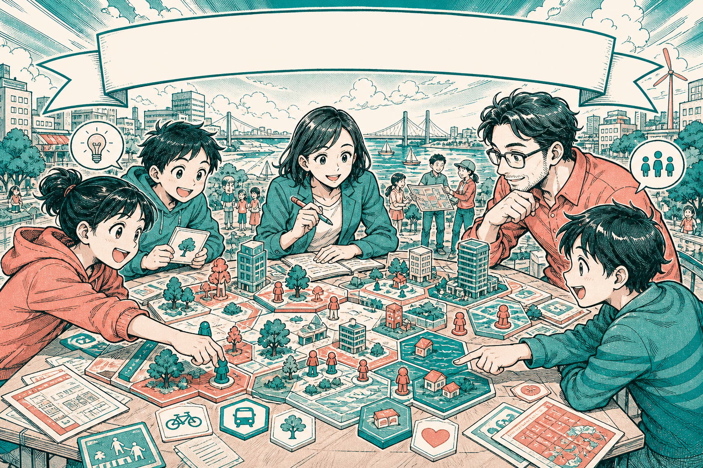

# Dr Non — Non-Gaming System

<p align="center">
  
</p>

<p align="center"><em>HUD overlays in the banner — speech-bubble icons, hex tokens, dashboard sheets — are illustration only. They are not the live floor interface.</em></p>

Small playable experiments by **Dr Non** (Non Arkaraprasertkul). Arcade-scale civic toys, not a product company.

Live floor: **[games.nonarkara.org](https://games.nonarkara.org)** · local: `node server.js` → [http://localhost:3000](http://localhost:3000)

## What this is

This repository is the source for a 16-bit browser floor of short games, research-style drills, and a few personal packs. One site, four wings:

| Wing | What you find |
|---|---|
| **TRAIN** | Lab tasks with a paper trail. Gains stay closest to what you practice. |
| **ARCADE** | Classics, shooters, and a sandbox. Scoreboards count. |
| **LEARN** | Math, language, science, and kids drills — fluency under a clock. |
| **LABS** | Hand-curated rooms: friends, parties, private packs. Drinking prompts are 18+. |

Every cartridge opens with a **briefing**: how to play, what it practises, and the limit of the claim. No ads. No login required.

These are **experiments**, not a studio product and not a clinical tool.

## Philosophy

Games taught Dr Non how to think before any book did. The floor exists so the next person can get that back — a system, a reflex, a memory — instead of another infinite feed.

Three moves hold it up:

1. **Not a game system.** A brain-expansion system. The time always dies; the question is whether the minutes gave anything back.
2. **Love is not enough. You need a science.** Cartridges sit on five named frameworks: Kahneman & Tversky (System 1 / System 2), Werbach (gamification), Thaler (nudge), neuroplasticity, and James Clear’s habit loop. The loop on the floor is briefing → play → result.
3. **Sign the board with four letters. Come back. Beat yourself.** That is the practice.

The honest claim is narrower than the marketing of “brain training.” Practice is specific. Near transfer (you get better at the task) is defended. Far transfer is not sold. Simons 2016 stays on every briefing on purpose.

The longer why lives on the floor as **About Dr Non** (the SIGNAL cart).

## Ethical use

Read this before you teach with it, cite it, or hang a high score on a wall.

- **Not clinical.** NGS is not a diagnostic, a therapy, or a substitute for care. TRAIN carts are schematic practice of named tasks, not validated assessments. “Mind in the Eyes · Lite,” for example, is a gaze-vocabulary drill — not the Baron-Cohen instrument.
- **Do not overclaim.** Each cart practises the skill it names. Broad transfer to IQ, school grades, or unrelated abilities is **not promised**. If you write about this floor, keep that sentence.
- **Age and setting.** Kids drills are for kids. Casino and drinking-prompt carts are **18+**. The drinking set is a prompt deck, not a bar: play it only with consenting adults, and never as an instruction to drink.
- **ROM / SWF Inspector** accepts a **legal** local backup (`.nes` / `.gb` / `.sfc` / `.swf`) and reads **header metadata only**. Do not drop files you do not have the right to possess.
- **Privacy on a clone.** Guest play stores scores on the device. This README does not document production account wiring, API keys, or deploy internals — those are not public learner material.
- **Credit the studies.** Mechanic studies from other open-source projects are named in [CREDITS.md](CREDITS.md). No third-party game is iframed.

If a briefing and a classroom pitch disagree, the briefing wins.

## How it works

Plain ESM. No build step, no package dependencies.

```
index.html  →  js/app.js (catalog: one entry per cartridge)
                 └─ js/games/*.js  (each cart is a renderer)
Shared:     js/ui.js  ·  js/storage.js  ·  js/brainGuides.js  ·  js/theory.js
Local only: server.js  (static files on port 3000)
```

A round is always the same shape:

1. **Briefing** — skill, round length, coach tip, paper when there is one, and the transfer caveat.
2. **Play** — keyboard and touch where the cart needs them.
3. **Result** — score, optional four-letter sign on the local board.

Wings are folders of attention, not separate binaries. You run **one** floor.

## How to play or run

Requires [Node.js](https://nodejs.org/). There is nothing to install from npm.

```bash
git clone https://github.com/Nonarkara/games.git
cd games
node server.js
```

Same entry: `npm start`. Open [http://localhost:3000](http://localhost:3000).

Then play like a visitor: pick a wing (TRAIN / ARCADE / LEARN / LABS), open a title, read the briefing, start the round. Optional checks for people changing code:

```bash
npm test
npm run check
```

Titles and play lines below are taken from the catalog in `js/app.js`. Nothing here is an invented name.

### TRAIN — lab tasks with a paper trail

| Game | Play |
|---|---|
| Dual N-Back | Watch each square and letter. Tap when either matches two turns ago. |
| Digit Span | Watch digits, type them back. Span grows until it breaks. |
| Colour Match | The word says RED but the ink is BLUE — tap the colour of the ink, not the word it spells. |
| Colour Match Pro | Tap the ink colour. All answers are white, so the buttons cannot hint. |
| Color March Pro | Find the word that spells RED while every answer wears a misleading colour. |
| Go / No-Go | Press on GO. Withhold on NO-GO. False starts cost more than slow hits. |
| Simon Sequence | Watch the pattern grow, then play it back. |
| Schulte Table | Tap 1→25. Eyes on center; peripheral vision does the finding. |
| Visual Search | Find the odd rotated letter in growing clutter. |
| Corsi Blocks | Watch the path light up, then tap it back. Span grows until it breaks. |
| Memory Palace | Place objects along a familiar route, then walk the route to recall them. |
| Flanker | Report the center arrow. Ignore the flanks — especially when they disagree. |
| Aim Trainer | Tap as many targets as you can in 30 seconds without missing. |
| Mental Math | Solve as many short arithmetic problems as you can in 45 seconds. |
| Mental Math Pro | Read the words then type the answer. Twenty-one minus sixteen equals what, in numbers? |
| Mental Math Thai | Read ๐–๙ and 0–9 in the same problem. ๒๓ + 16, ๔๒ × ๒ — same math, two scripts. |
| Type Rush | Type the shown words for 30 seconds; speed and accuracy both count. |
| Reflex Matrix | Tap glowing cells before they fade. Speed escalates each wave. |
| Trail Making | Connect 1→2→3, then switch between numbers and letters: 1→A→2→B. |
| Mental Rotation | Decide whether two shapes are rotated copies or mirror images. |
| Iowa Gambling Task | Draw from four decks and learn which ones pay off over time. |
| Cognitive Reflection | Solve three short problems whose obvious first answer is usually wrong. |
| Raven's Matrices | 3x3 pattern grid, one cell missing. Pick the option that completes the rule. |
| Sternberg Memory Scan | Memorize a short letter set, then decide whether one shown letter was in it. |
| Number Sense (ANS) | Pick the dot cloud with more dots before there is time to count. |
| Card Sorting (WCST) | Sort by the hidden rule. It changes every 5 correct sorts. Notice the change. |
| Tower of London | Three pegs, three balls. Match the target in the fewest moves. |
| Mind in the Eyes · Lite | Match a simple gaze drawing to the emotion word that fits best. |
| Posner Cueing | Follow a flashing cue, then respond when a dot appears—some cues mislead you. |
| Change Blindness | Find the one square that changes while a blank flash hides the movement. |
| Operation Span | Check each equation while holding letters, then recall the letters in order. |
| Chimp Test | Tap numbered cells in order after the numbers disappear. |
| Calibration | Give a high and low estimate that you believe has a 90% chance of being right. |
| Stop Signal | Start a left/right response, then cancel it when a delayed STOP signal appears. |
| Reaction Gate | Wait for the amber box, then tap it. Early taps count as misses. |
| One-Back | Tap MATCH if the square is in the same place as last turn. |
| Oddball | Tap only when the rare shape appears. Ignore the common one. |
| Backward Span | Watch digits, then type them back in reverse order. |
| Memory Matrix | Watch cells light up, then tap the same cells from memory before the grid clears. |

### ARCADE — classics, shooters, and the sandbox

| Game | Play |
|---|---|
| Cyber Tetris 1984 | Rotate falling blocks to complete rows without leaving gaps. |
| Breakout 1976 | Shape rebound angles, keep the rally alive, clear the wall. |
| Pong 1972 | Read the ball early and race the CPU to seven. |
| Cyber Pac-Man 1980 | Eat every dot, dodge four ghosts, and use power pellets to fight back. |
| Retro Cyber Snake | Grow, turn, do not bite your own tail. |
| Space Defender | Move the laser turret, dodge shots, and clear each invader wave. |
| Flappy Cyber Bird | Tap-to-fly through pipes. Precision over panic. |
| Minesweeper Pro | Flag mines, read the numbers, clear the grid. |
| Slide 2048 | Merge matching tiles. Reach 2048 without boxing yourself in. |
| Cyber Blackjack 21 | Hit, stand, manage the bankroll against the dealer. |
| Trivia Master | Answer quick questions about history, science, sci-fi, and games. |
| Pattern Breaker | Crack a hidden 4-node path with Mastermind-style hints. |
| ROM / SWF Inspector | Drop a legal .nes / .gb / .sfc / .swf backup — header metadata only. |
| AI Game Builder | Prompt or pick a preset; get a playable micro-game live. |
| Warehouse Push | Push every crate onto a target. You can undo a step, but you can never pull. |
| Rock Paper Scissors | Pick rock, paper, or scissors. The CPU reads your habits — mix it up. |
| Asteroids | Rotate, thrust, fire. Rocks split when hit and the screen wraps on both axes. |
| Frogger | Cross five lanes of traffic. Every crossing rebuilds the road faster. |
| Connect Four | Drop discs into columns and connect four before the computer does. |
| Klondike Solitaire | Build alternating-color stacks, then move each suit from Ace to King. |

### LEARN — math, language, science, kids drills

| Game | Play |
|---|---|
| Sudoku Sprint | Fill a small board under a clock. Every digit must earn its cell. |
| Fifteen Puzzle | Slide tiles into order. Every move is a plan under a shrinking empty cell. |
| Monty Hall | Pick a door, see one empty door opened, then choose whether to stay or switch. |
| Number Chain | Find the rule linking a number sequence, then enter the next number. |
| Word Guess | Guess a five-letter word in six tries using green and amber letter clues. |
| Mate in One | Six named mating patterns. Find the single move that ends the game. |
| Ear Trainer | Two tones, always ascending. Name the interval. Relative pitch is trainable at any age. |
| Morse Code | Hear a short Morse rhythm, then choose the letter it represents. |
| Tower of Hanoi | Move every disk to peg 3 in the fewest moves. |
| Lights Out | Each press flips a cell and its neighbours. Darken a solvable grid. |
| Nonogram | Fill a 5×5 picture using the number clues beside each row and column. |
| Nim | Take any number from one heap. Whoever takes the final token wins. |
| Make 24 | Combine four numbers with +, −, ×, or ÷ to make exactly 24. |
| Tic-Tac-Toe | Place three in a row before the CPU does. Hard mode is unbeatable. |
| Anagram Scramble | Unscramble letters into real words under pressure. |
| Word Builder | Build valid words from 7 tiles in 60 seconds. |
| Periodic Quest | Match element symbols to names across 10 rounds. |
| Capital Quest | Match each country to its capital across ten quick rounds. |
| Math Safari Rush | Solve equations to clear the path. |
| Memory Match | Flip cards, match animal pairs, watch the streak. |
| Word Search Quest | Find hidden words in a letter grid. |

### LABS — personal packs and party prompts

Drinking-prompt carts are **18+**. They are prompt decks, not a bar.

| Game | Play |
|---|---|
| Non-Trivial | Answer questions drawn from Dr Non’s writing on books, cities, bikes, and sound. |
| Blow Into The Cartridge | Pick a 90s/00s deck, shout answers together, and keep score on paper. |
| King's Cup | 52-card ring of fire. Each card = a rule. Draw, deal, drink. |
| Never Have I Ever | Read a statement and lower one finger if you have done it. |
| Most Likely To | Read a prompt, point at one person, and count the group’s votes. |
| Ride the Bus | 4 phases: red/black, higher/lower, inside/outside, guess the suit. Survive all four. |
| Power Hour | Follow one new prompt each minute for a 60-minute group session. |
| Buzz (21) | Count to 21. +1, +2, or +3 each turn. Whoever says 21 drinks. |
| Truth or Dare | 30 truths, 30 dares. Answer or drink. |
| Higher or Lower | Single deck streak. Guess the next card. Drink on a wrong guess. |
| 2 Truths & a Lie | Tell two true statements and one lie, then let the group vote. |

**About Dr Non** is the SIGNAL cart on the same floor (not a game): why the floor exists.

## License

[MIT](LICENSE). Copyright (c) 2026 Non Arkaraprasertkul.
